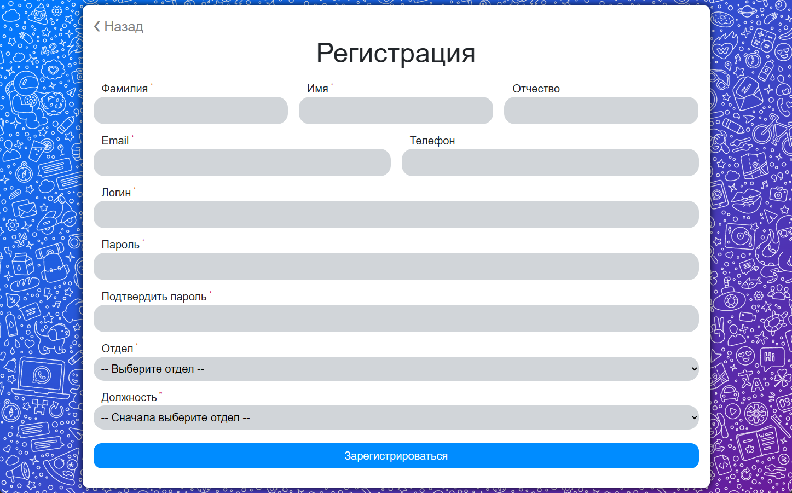
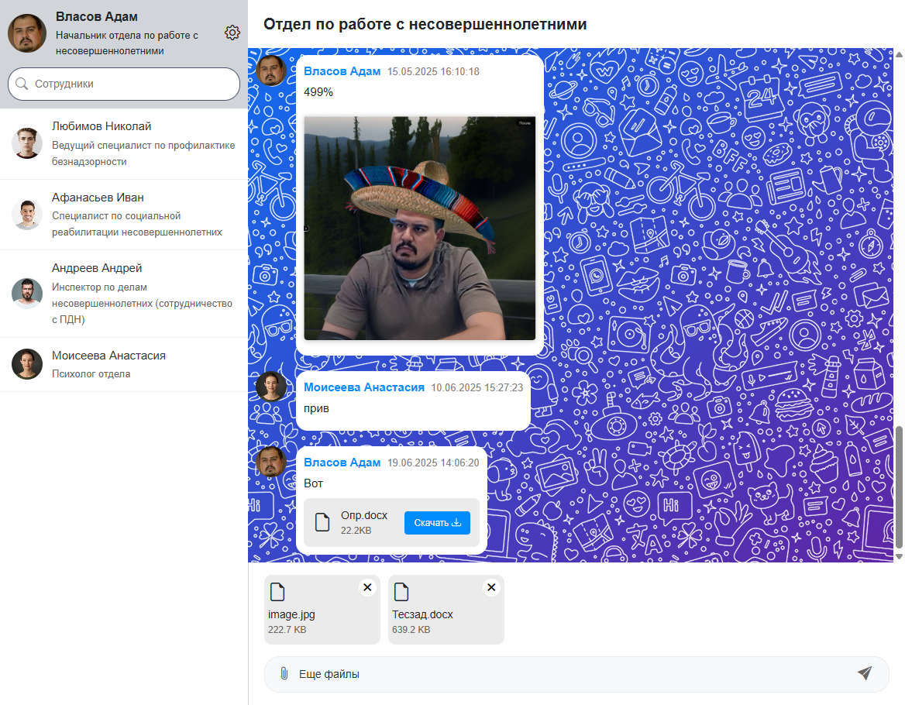
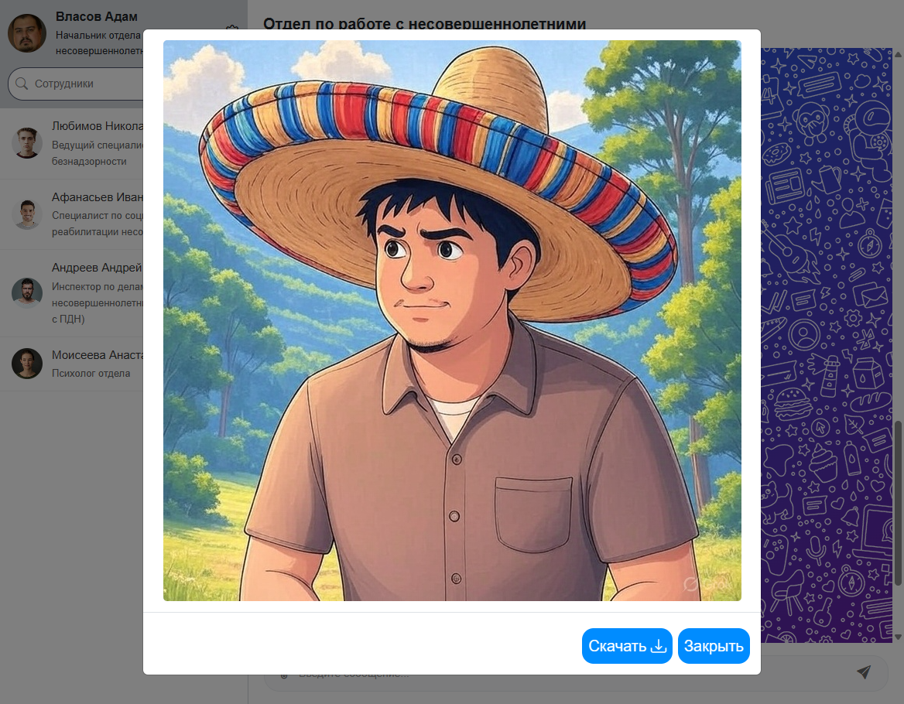

# 🏣 Корпоративный мессенджер

[](https://dotnet.microsoft.com/en-us/download/dotnet/9.0)
[](https://learn.microsoft.com/ru-ru/ef/core/get-started/overview/install)
[](https://www.microsoft.com/en-us/sql-server/sql-server-downloads)

> **"CorpNet Messenger"** — это внутренний корпоративный мессенджер, который позволяет сотрудникам компании обмениваться текстовыми сообщениями и файлами в режиме реального времени.

---

### 🚀 Основные функции:

- Обмен текстовыми сообщениями
- Отправка и получение файлов
- Авторизация и аутентификация пользователей
- Работа в группах/комнатах
- История переписки

## 🛠️ Технологии

| Категория        | Технология                     |
|------------------|--------------------------------|
| Backend          | ASP.NET Core 9                 |
| ORM              | Entity Framework Core (Code First) |
| База данных      | MS SQL Server                  |
| Фронтенд         | HTML/CSS/JavaScript/Bootstrap  |
| База данных      | MS SQL Server                  |
| Дополнительно    | SignalR для чата в реальном времени |

---

## 🗃️ Структура проекта

```
📦 CorpNetMessenger/
├── 📂 Domain/                      # Доменные модели и интерфейсы
│   ├── 📂 DTOs/                    # Data Transfer Objects (чистые модели данных)
│   ├── 📂 Entities/                # ORM-сущности
│   ├── 📂 Interfaces/              # Сервисные интерфейсы
│   └── 📂 MappingProfiles/         # Профили AutoMapper
│
├── 📂 Application/                 # Основная логика приложения (слой приложения)
│   ├── 📂 Common/                  # Общие компоненты
│   ├── 📂 Converters/              # Конвертеры для преобразования данных
│   └── 📂 ValidationAttributes/    # Кастомные атрибуты валидации
│
├── 📂 Infrastructure/              # Реализация репозиториев и сервисов
│   ├── 📂 Data/                    # Контекст EF + миграции
│   ├── 📂 Repositories/            # Работа с БД
│   └── 📂 Services/                # Бизнес-логика
│
├── 📂 Web/                         # Веб-слои
│   ├── 📂 Areas/                   # Логические разделы (Admin, Messaging)
│   ├── 📂 Controllers/             # MVC контроллеры
│   ├── 📂 Hubs/                    # SignalR хабы
│   ├── 📂 ViewModels/              # Модели представления
│   └── 📂 Views/                   # Razor-шаблоны
```

## 📸 Скриншоты

### Авторизация


### Регистрация


### Чат


### Увеличенное изображение 


### Информация о сотрудниках


### Редактирование профиля


### Запросы на регистрацию (Админ-панель)


---

## 📬 Связь

Если у вас есть вопросы или предложения, напишите мне:

- Email: mornival@outlook.com
- Telegram: @Fl1cker_0